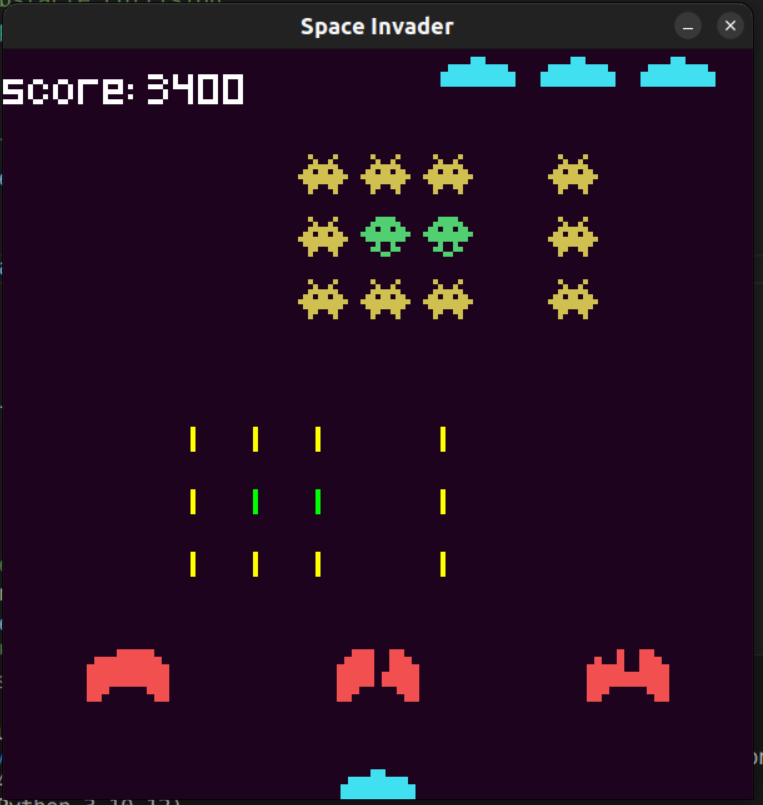

# Python Game
## Aim
Get comfortable with Pygame. Go through online tutorials and build one.
## Packages required
To install Pygame, you need to have Python installed on your system. If you haven't installed Python yet, you can download it from [python.org](https://www.python.org/downloads/) and follow the installation instructions.

Once Python is installed, you can install Pygame using pip, which is the package installer for Python. Open your command line or terminal and enter the following command:
```bash
pip install pygame
```

This command will download and install the latest version of Pygame and its dependencies from the Python Package Index (PyPI). Once the installation is complete, you can start using Pygame to develop games and multimedia applications in Python.

## Game Output
